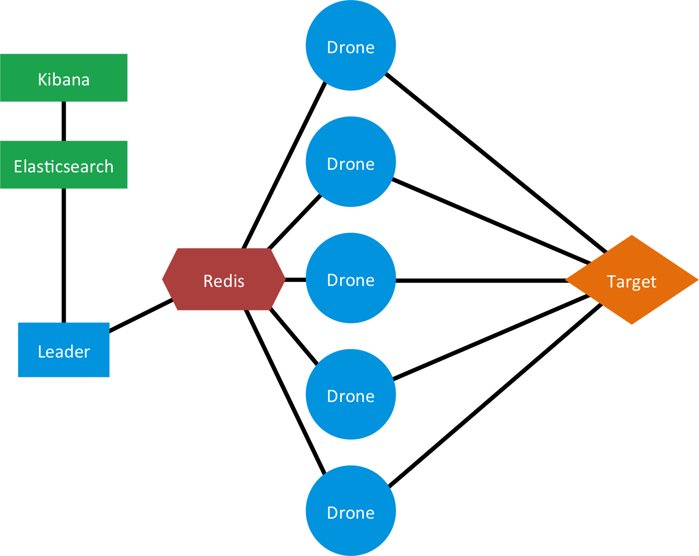
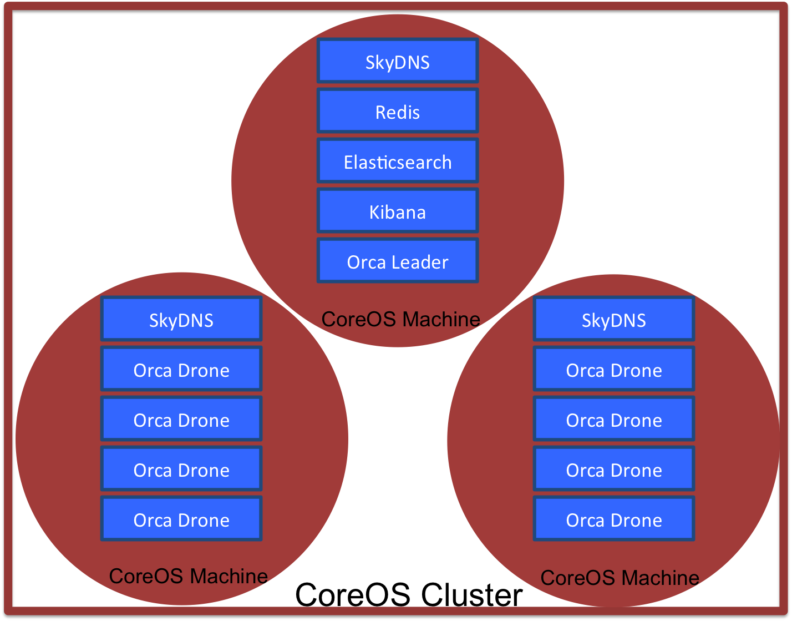

# Orca
Simulation-Based, Distributed Load-Testing Made Simple.

## Introduction
Imagine your product in use.  Depending on what you've built, its web interface may be expected to successfully handle interactions from hundreds, if not thousands, of users at once.  You adhere to test-driven development, but there is a problem.  While tests for correctness are relatively straightforward, finding problems and/or bottle-necks in technically correct code is a lot harder.  How do you detect flaws that only appear when your system is under heavy use?

The answer is load-testing, and that's what Orca is all about.  Orca uses Drones, agents that launch custom tests for you.  Drones work together in swarms of arbitrary size. So, spin up a large swarm, give each Drone a copy of your test, and point them all at your product's interface.  Orca lets you simulate the crushing load of your (hopefully) many, many customers.

Tests are loaded into Orca via npm, giving the platform incredible flexibility.   We kept Orca un-opinonated so that you can focus on writing tests for your product.  Then just sit back while Orca fetches and deploys them automatically.

## Examples
Check the README files within each `examples` subdirectory for detailed deployment examples.  The following sections aim to provide background and context for how Orca works.


## Architecture
Orca has several pieces.  Here we describe the overall structure.  The following sections also offer a crash-course in some of the newer technologies used in CoreOS.  Use them to get yourself oriented, but please refer to their respective documentation for full details.

### Orca Concept
This diagram describes the basic layout of Orca.  A swarm of Drones launches tests against a target web service.  Results are passed to the Leader by using Redis.  The Leader stores result data in Elasticsearch which can be visualized with Kibana.  These components are described in greater detail below.

---
### Orca On CoreOS
This diagram shows how Orca is deployed on a CoreOS cluster.  CoreOS machines need Docker to run applications, represented here by Docker container rectangles (See below for greater detail on each component).  While this diagram shows one possible configuration, there are some things to keep in mind: 

1. You can build CoreOS clusters of arbitrary size.
2. You can deploy an arbitrary number of Drone containers.
3. The placement of containers within the cluster is controlled by fleet and may not appear quite this segregated, but what *is* guaranteed is having one SkyDNS container on every machine.


---
## Components
### Target Application
In the introductory examples, the target app is part of the Orca cluster.  This in not a requirement.  Orca only needs an IP address to target.  Placing the target in the cluster was just very convenient when writing the simplest examples.

### Drones
Drones load tests and launch them against a target IP address.  There can be one Drone or many, it just depends on your needs. Multiple Drones are activated in Orca by submitting multiple template `service` files(see *Service Files* below). Each Drone is encapsulated in a Docker container as a microservice.  Their source is specified in `src/drone.coffee`.  You can see that they rely on ES6-based generators, requiring Node 0.11+, the latest master of CoffeeScript 1.8, and the `--harmony` flag.  

You need to tell the Drone the location of Redis in the `config.cson`, behavior that is automated in its `service` file (see *SkyDNS* below.).  When activated, a Drone waits for instructions.  Upon contacting the Leader, the Drone does an `npm install` to load the required test module.  The Drone then runs its test and returns those results to the Leader.  

### Leader
The Leader orchestrates the actions of the Drone swarm.  It is encapsulated in its own Docker container as a microservice.  The Leader's source is specified in `src/leader.coffee`.  You can see that it relies on ES6-based generators, requiring Node 0.11+, the latest master of CoffeeScript 1.8, and the `--harmony` flag.  

The Leader needs the location of Redis and whatever tests it must implement.  These are provided in the `config.cson` for the Leader, behavior that is automated in its `service` file (see *SkyDNS* below.).  When activated, the Leader finds the test it is expected to implement and announces it to the swarm.  It continues to announce once-per-second until it gathers replies from the required number of Drones, called a quorum.  Once it has a quorum, the Leader has the Drones launch the test at the target interface.  As Drones finish, they return their results to the Leader for aggregation.

### Redis
Redis's publish-submit function is used to allow the Leader to communicate with and organize the Drone swarm.  This method is efficient because the Leader does not need to know the IP address of every Drone.  As long as the Leader and Drones can find Redis, they can communicate.  Redis is encapsulated in its own Docker container as a microservice.

### Elasticsearch
**Coming Soon!!**

### Kibana
**Coming Soon!!**

### SkyDNS
SkyDNS is used to allow human-friendly names for services within Orca.  That's how we can write addresses in `config.cson` without knowing the final IP address of a service like Redis. SkyDNS sits on the key-value store, [etcd][3], that runs natively within CoreOS.  URLs adhere to the following schema:

  ```
  <service name>.<userID>.<domain>

  # Example
  redis.02.orca
  ```

Addresses are stored with etcd keys built by reversing the url order.  This all falls under the `skydns` namespace inside the key-store.

  ```
  # Example: Store redis.02.orca at 54.67.24.1:2002
  etcdctl set /skydns/orca/02/redis '{"host":"54.67.24.1", port:2002}'

  ```

For the cluster, we've created the "fake" top-level domain `.orca`.  SkyDNS intercepts all URL requests and routes `.orca` requests to a service on the cluster.  For any other domain, SkyDNS lets requests pass through to a real DNS server, Google's 8.8.8.8:53.  That means SkyDNS does not interfere with calls to the external Internet, such as a `git pull` or `www.example.com`.

SkyDNS is encapsulated in a Docker container as a microservice.  Any Docker container that needs access to `.orca` lookups (such as the Leader and Drone containers) must be *linked* with the SkyDNS container. This is done at runtime with the `--link skydns:dns` flag.  The IP address passed into the requesting container is used to overwrite the container's `/etc/resolve.conf` file.  `resolve.conf` tells the operating system where to direct a URL request for translation into an IP address, and SkyDNS takes over that role.

All requesting containers must be linked to a SkyDNS container. To avoid the messiness of multi-host Docker linking, we simply have one SkyDNS container on each CoreOS machine in the cluster.  Fleet makes this easy with the `Global=` tag in the service file (see below).  We can get away with multiple SkyDNS containers because it is just a lookup tool.  It accesses the values stored in etcd, which are available cluster-wide.  

SkyDNS containers only need to be setup once when the CoreOS cluster is established.  Multiple users can make use of them, so generally there should be no reason to manipulate them once created.

### CoreOS
CoreOS is an operating system so lightweight that it relies on Docker to load and run whatever application you ask it to deploy.  CoreOS machines are designed to connect and bear a workload as a cluster, which is why we picked it for Orca.  Applications and their components are submitted as jobs to a control system called fleet.  By tying two technologies together, fleet is able to sit at the cluster level, accept your commands, and orchestrate efforts accordingly.
- Individual machines use the established tool, systemd, and accept instructions via [unit-files][0].  
- Communication between machines is handled with [etcd][3], a key-value store that uses the Raft algorithm to achieve distributed consensus.

---
### fleetctl
If you examine the deployment instructions, you will see `fleetctl` (pronounced "fleet control") is called repeatedly.  `fleetctl` is a command-line tool that is part of the larger software package, fleet.  fleetctl accepts "services" defined as unit-files. These lay out exactly what the CoreOS machine needs to call to spin-up your app, similar to a shell script.  These almost always start a Docker container.

fleetctl is a powerful tool.  It provides built in SSH capability via the `--tunnel <address>` flag, and can reference a job anywhere in the cluster via its `*.service` file.  That means we don't need to care about where a job ends up on the cluster.  Fleet puts it *somewhere* and takes care of the details for us.

---
### Service Files
Service files are based on systemd and divided into sections.

`[Unit]` just describes the service and lets fleetctl know about job ordering through `Before` and `After` flags.

`[Service]` defines the actual guts of the unit.  There are two main types of commands here.

- `ExecStartPre` lists any commands that should occur before the service starts.  Here, we start downloading the Docker container that holds the Node server.  This command is convenient for handling tasks while the service is forced to queue for another unit.

- `ExecStart` list any commands that occur when the service is active.  Here, we run the Docker container.

`[X-Fleet]` defines special commands unique to fleet.  The most important directive is `Global`, allowing a service to be deployed on every machine in the cluster.

Service files get even more flexible.  You cannot have more than one job with the same name running in a CoreOS cluster.  But, you can specify a *template* and then provide an identifier at runtime.  For example, the file `drone@.service` is a template file describing a Drone instance.  We can run three instances of this service in the cluster by calling:

  ```
  fleetctl --tunnel coreos.pandastrike.com drone@{1..3}.service
  ```

The services are all based on a single file, but the services are named `drone@1.service`, `drone@2.service`, and `drone@3.service`, respectively.  The services are nearly identical, but we have the option of editing the unit-file to allow subtle differences.  In the unit-file, we can place `%i` anywhere as a placeholder for the characters between `@` and `.` in the filename.

For PandaStrike's CoreOS test-cluster, we hand out "userIDs" (a double digit identifier from 00 to 99) to keep different user's services from colliding.  We use integers because it is a nifty, if somewhat cumbersome, way to allocate ports to services.  Here's an example:

  // **redis@.service**
  ```
  ExecStartPre=/usr/bin/etcdctl set /skydns/orca/%i/redis \
      '{"host":"${COREOS_PUBLIC_IPV4}", "port":20%i}'


  # Pull Official Redis Docker Container
  ExecStartPre=-/usr/bin/docker kill redis-%i
  ExecStartPre=-/usr/bin/docker rm redis-%i
  ExecStartPre=/usr/bin/docker pull dockerfile/redis

  # Deploy Redis.  This container is linked with the SkyDNS container on this machine.
  ExecStart=/usr/bin/docker run --name redis-%i -p 20%i:6379 dockerfile/redis
  ```

  When we run as user 02, every `%i` is replaced with `02` before it is loaded into the cluster.
  ```
  ExecStartPre=/usr/bin/etcdctl set /skydns/orca/%i/redis \
      '{"host":"${COREOS_PUBLIC_IPV4}", "port":2002}'


  # Pull Official Redis Docker Container
  ExecStartPre=-/usr/bin/docker kill redis-02
  ExecStartPre=-/usr/bin/docker rm redis-02
  ExecStartPre=/usr/bin/docker pull dockerfile/redis

  # Deploy Redis.  This container is linked with the SkyDNS container on this machine.
  ExecStart=/usr/bin/docker run --name redis-02 -p 2002:6379 dockerfile/redis
  ```

So, there is some planning required.  You will have to do the work of blocking out namespaces for services in your cluster.  Also, this requires well-behaved users, but hopefully you trust people you're letting into your cluster, haha.   The point is a single template file can be used to deploy many services into the cluster while handling the details for you.


This is just an introduction.  There are many other options in a unit-file, so please see the [documentation][2] for more.

---
### Dockerfile
Docker containers are lightweight virtual machines.  You can load a wide variety of operating systems and software inside.  Because of this, CoreOS is almost completely dependent on them to load applications beyond it's limited set.  Orca uses the containers to encapsulate apps as micro-services (ex. SkyDNS and Redis are both inside their own containers.)  Unit-files script the launch of containers in CoreOS.

[0]:https://coreos.com/
[1]:https://docker.com/
[2]:https://coreos.com/docs/launching-containers/launching/fleet-unit-files/
[3]:https://coreos.com/docs/distributed-configuration/getting-started-with-etcd/
